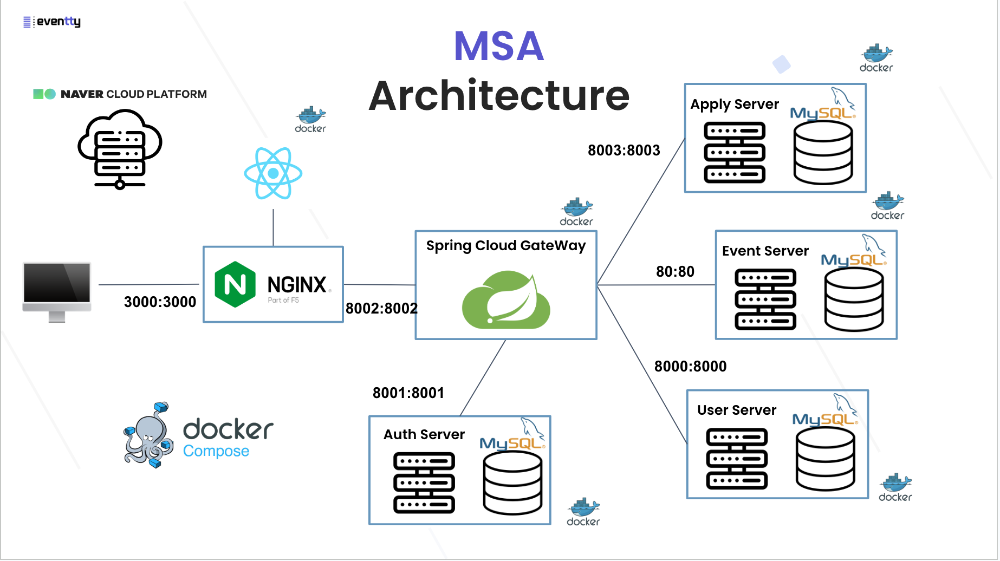

# Eventty

## 프로젝트 소개 

저희 프로젝트는 사용자의 역할을 호스트(주최자)와 참여자로 나누어 행사를 주최를 하고, 참여(지원)를 할 수 있도록 중개해주는 중개 플랫폼입니다.

클라우드를 활용하여 클라우드 기반 데이터 플랫폼을 구상하였고, 해당 플랫폼에서 강력한 아키텍처이면서 많은 기업들에서 사용하고 있는 MSA를 경험하고 학습해보기 위해 선택하였습니다.

## 프로젝트 구조 

**(CI/CD 미적용 단계)**

## 프로젝트 주요 관심사

### 공통
- 짧은 기간 동안 프로젝트를 성공적으로 이끌기 위해선? 
    - **방법론:** 애자일(AGILE) 방법론
    - **소통 방법:** Slack 
    - **학습 및 정보 공유:** Notion[(Eventty: Notion Main Page)](https://www.notion.so/eventty-25ac7c30c552480db838f366c4bc2c85)
    - **브랜치 관리:** Git Flow[(Eventty: Git Branch Model)](https://www.notion.so/Git-Branch-Model-0ae3bd6df50b4dffb946e0da68a048fb) 
    - **API 명세서:** Notion -> Swagger[(Eventty: Notion API Specs)](https://www.notion.so/API-0165c5bd7e62499a8414b3e0c419c583) ***(스웨거 정리 페이지 필요?)***
    - **Code Convention:** Frontend[(Eventty: Frontend Code Convention)](https://www.notion.so/Code-Convention-Frontend-9ec1532252d44c5db1d647137e7191f5), Backend[(Eventty: Backend Code Convention)](https://www.notion.so/Code-Convention-Backend-64cfd122f4ae40e7ac599bac97131098)

### 프론트엔드

이와 같은 방식으로 정리하면 프엔에서 유경이가 많이 적어줄 게 없으면 조금,, 차이가 날것 같은데 이 방식 별로라서 다른 방식 떠오르는 거 있으면 슬랙에 올려줘 

### 백엔드
- 기초에 집중
    - **SOLID 원칙**
    - **ACID와 Transaction**
    - **추상화, 캡슐화, 다형성 및 관심사 분리**
    - **예외 처리** ➡️ 예외 전환
- 모놀리식과의 차별점
    - **확장성** ➡️ 서버를 어떻게 분리할 것인가 ***(페이지 정리 필요)***
    - **REST API 통신** ➡️ Restful API 통신
    - **서버 간의 통신** ➡️ 동기 혹은 비동기 방식 통신
    - **개발 환경 구축** ➡️ Docker Compose 적용
    - **통신 보안적인 측면 고려** ➡️ 필터 수준 보안 => 게이트웨이 및 인증서버 수준 보안(링크)
    - **전체 보안 수준 고려** ➡️ JWT, CSRF 발급 및 검증 방식(링크)
    - **로깅 추적** ➡️ 구체화된 로깅 방식 및 예외 처리 방식 + 분산 추적
- 패키징 전략
    - **DDD:** Domain Drive Design
- 각종 패턴들
    - **싱글톤 패턴(Singleton Pattern)**
    - **파사드 패턴(Facade Pattern)**
    - **프록시 패턴(Proxy Pattern)**
    - **팩토리 패턴(Factory Pattern)** 
- MSA를 적용해서 고려된 기능(이부분이 조금,, 문장 자체가 좀 걸리네요)
    - **Response Format 통일** ➡️ LSP 위배 고려, ResponseBodyAdvice 도입
    - **Context 객체 도입** ➡️ User ID, Authorities, Tracking ID
    - **Global Interceptor, AOP** ➡️ 권한 검증, Context객체 생성
    - **Web Flux** ➡️ 토큰 검증 요청 및 업데이트
- 성능 개선 (유지보수성)
    - **Global Error Response** ➡️ Controller Advice, Exception Handler 도입
    - ... 정리중 